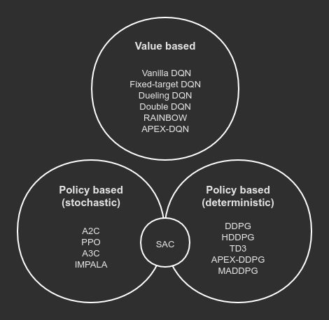

Algorithm APIs
================================================================
**Author**: `Muhan Li <https://github.com/iffiX>`_

Currently, Machin supports three major types of model-free RL algorithms:

1. Value based algorithms
2. Deterministic policy based algorithms
3. Stochastic policy based algorithms

Algorithms could be grouped into respective categories with the following graph:

   Algorithm categories

We will use some basic symbols to simplify the description:

1. ``...`` means one or more dimensions, with non-zero sizes.
2. ``<>`` means optional results / arguments. ``<...>`` means any number of optional results / arguments.

**Note**: When an algorithm API returns one result, the result will not be wrapped in a tuple, when it returns multiple results, results will be wrapped in a tuple. This design is made to support::

    # your Q network model only returns a Q value tensor
    act = dqn.act({"state": some_state})

    # your Q network model returns Q value tensor with some additional hidden states
    act, h = dqn.act({"state": some_state})

Core APIs
----------------------------------------------------------------
All algorithms provide three core APIs:

1. Acting API, beginning with "act".
2. Storing API, beginning with "store".
3. Training API, with name "update"

Acting API
++++++++++++++++++++++++++++++++++++++++++++++++++++++++++++++++
Users will invoke the "act*" api provided by the framework during sampling,
to let their models produce an action with respect to their state input,
"*" indicates additional extensions such as "_with_noise", "_discreet", etc.
depending on the implementation and type of the RL framework.

Below is a list of supported acting APIs of different frameworks:

+-----------------+-------------------------+---------------------------------------------+---------------------+-----------------------+
| Algorithm class | Acting API              | Input & output                              | Discreet/Continuous | Note                  |
+-----------------+-------------------------+---------------------------------------------+---------------------+-----------------------+
| | DQN           | act_discreet            | | Dict[str, State[batch_size, ...]]         | D                   |                       |
| | DQNPer        |                         | | -> Action[batch_size, 1], <...>           |                     |                       |
| | DQNApex       +-------------------------+---------------------------------------------+---------------------+-----------------------+
| | RAINBOW       | act_discreet_with_noise | | Dict[str, State[batch_size, ...]]         | D                   |                       |
|                 |                         | | -> Action[batch_size, 1], <...>           |                     |                       |
+-----------------+-------------------------+---------------------------------------------+---------------------+-----------------------+
| | DDPG          | act                     | | Dict[str, State[batch_size, ...]]         | C                   |                       |
| | DDPGPer       |                         | | -> Action[batch_size, action_dim], <...>  |                     |                       |
| | HDDPG         +-------------------------+---------------------------------------------+---------------------+-----------------------+
| | TD3           | act_with_noise          | | Dict[str, State[batch_size, ...]]         | C                   |                       |
|                 |                         | | -> Action[batch_size, action_dim], <...>  |                     |                       |
|                 +-------------------------+---------------------------------------------+---------------------+-----------------------+
|                 | act_discreet            | | Dict[str, State[batch_size, ...]] ->      | D                   |                       |
|                 |                         |                                             |                     |                       |
|                 |                         | | Action[batch_size, 1],                    |                     |                       |
|                 |                         | | Prob[batch_size, action_num],             |                     |                       |
|                 |                         | | <...>                                     |                     |                       |
|                 +-------------------------+---------------------------------------------+---------------------+-----------------------+
|                 | act_discreet_with_noise | | Dict[str, State[batch_size, ...]] ->      | D                   |                       |
|                 |                         |                                             |                     |                       |
|                 |                         | | Action[batch_size, 1],                    |                     |                       |
|                 |                         | | Prob[batch_size, action_num],             |                     |                       |
|                 |                         | | <...>                                     |                     |                       |
+-----------------+-------------------------+---------------------------------------------+---------------------+-----------------------+
| | A2C           | act                     | | Dict[str, State[batch_size, ...]] ->      | C/D                 | | Continuous/Discreet |
| | A3C           |                         |                                             |                     | | depends on the      |
| | PPO           |                         | | Action[batch_size, ...],                  |                     | | distribution you    |
| | TRPO          |                         | | Log_Prob[batch_size, <1>],                |                     | | are using to        |
| | SAC           |                         | | Entropy[batch_size, <1>],                 |                     | | reparameterize      |
| | IMPALA        |                         | | <...>                                     |                     | | your network        |
+-----------------+-------------------------+---------------------------------------------+---------------------+-----------------------+
| MADDPG          | act                     | | List[Dict[str, State[batch_size, ...]]]   | C                   |                       |
|                 |                         | | -> List[Action[batch_size, action_dim],   |                     |                       |
|                 |                         | |         <...>]                            |                     |                       |
|                 +-------------------------+---------------------------------------------+---------------------+-----------------------+
|                 | act_with_noise          | | List[Dict[str, State[batch_size, ...]]]   | C                   |                       |
|                 |                         | | -> List[Action[batch_size, action_dim],   |                     |                       |
|                 |                         | |         <...>]                            |                     |                       |
|                 +-------------------------+---------------------------------------------+---------------------+-----------------------+
|                 | act_discreet            | | List[Dict[str, State[batch_size, ...]]]   | D                   |                       |
|                 |                         | | -> List[Action[batch_size, 1],            |                     |                       |
|                 |                         | |         Prob[batch_size, action_num],     |                     |                       |
|                 |                         | |         <...>]                            |                     |                       |
|                 +-------------------------+---------------------------------------------+---------------------+-----------------------+
|                 | act_discreet_with_noise | | List[Dict[str, State[batch_size, ...]]]   | D                   |                       |
|                 |                         | | -> List[Action[batch_size, 1],            |                     |                       |
|                 |                         | |         Prob[batch_size, action_num],     |                     |                       |
|                 |                         | |         <...>]                            |                     |                       |
+-----------------+-------------------------+---------------------------------------------+---------------------+-----------------------+

Storing API
++++++++++++++++++++++++++++++++++++++++++++++++++++++++++++++++
.. note::
    `store_transition` api is now deprecated, please use `store_episode`
    only.

Algorithms generally encapsulate a replay buffer inside, the replay buffer is not
necessarily a "real" replay buffer. For online algorithms such as A2C and PPO with
no replaying mechanisms, the replay buffer is used as a place to put all of the
samples, and is cleared after every training/update step::

    # sample a batch
    batch_size, (state, action, reward, next_state,
                 terminal, target_value, advantage) = \
        self.replay_buffer.sample_batch(-1,
                                        sample_method="all",
                                        ...)

    ...
    self.replay_buffer.clear()

All frameworks use the same `store_episode` API to store a full episode into
the replay buffer::

    some_framework.store_episode(episode: List[Union[Transition, Dict]])

Training API
++++++++++++++++++++++++++++++++++++++++++++++++++++++++++++++++
All frameworks supports the ``update`` function, but the keyword arguments
of the ``update`` function might be a little bit different. For example, DDPG
allows you to choose update actor/critic/their targets, individually, while
DQN only supports choose to update Q network/its target individually.

Moreover, the update function of offline algorithms such as DDPG and online
algorithms such as A2C and PPO are different. Because A2C and PPO will not
update on outdated samples, their ``update`` function contains an internal
update loop, therefore you should not call them many times::

    # DDPG update:
    if episode > 100:
    for i in range(step.get()):
        ddpg.update()

    # PPO update:
    # update() already contains a loop
    ppo.store_episode(tmp_observations)
    ppo.update()

and their ``update`` will also clear the internal replay buffer
every time. So you are recommended to **read the implementation** of your
selected algorithm before using it somewhere.

Non-core APIs
----------------------------------------------------------------
All algorithms provide these non-core APIs:

1. Saving/Loading API, with name "save" and "load".
2. Learning Rate Scheduler API, with name "update_lr_scheduler".

Saving/Loading API
++++++++++++++++++++++++++++++++++++++++++++++++++++++++++++++++
All frameworks provide this pair of APIs, for saving and loading models passed
to the algorithm. Internally, the models passed to the algorithm framework will
become a member of the framework instance, for example::

    dqn = DQN(q_net, q_net_t, t.optim.Adam, nn.MSELoss(reduction='sum'))

    # you may access q_net and q_net_t with:
    print(dqn.qnet)
    print(dqn.qnet_target)

You can print the ``_is_restorable`` attribute of the algorithm **class** to view
models saved/loaded internally, and print the ``_is_top`` attribute of the algorithm
**class** to view top level models, like Q network, actor network, critic network, etc.::

    print(DQN._is_restorable)
    # ["qnet_target"]
    print(DQN._is_top)
    # ["qnet", "qnet_target"]

Saving/Loading API requires you to provide a directory to save/load the models,
an *optional* model name map to specify the mapping relation between "model <-> saved model name",
and an *optional* version number indicating the version of save::

    # Model dqn.qnet_target will be saved **as a whole** in "./qnt_1000.pt"
    # **saved as whole** means saving like: torch.save(dqn.qnet_target, ...)
    dqn.save("./", network_map={"qnet_target": "qnt"}, version=1000)

    # If no name mapping is specified, the default "qnet_target" will be used
    # as the saving name
    dqn.save("./", version=1000)

    # If no version is specified, the default saving version number is 0
    dqn.save("./", network_map={"qnet_target": "qnt"})

    # If no version number is specified, then the model with the largest version
    # number will be loaded
    dqn.load("./", network_map={"qnet_target": "qnt"})

    # Or specify a specific version to load
    dqn.load("./", network_map={"qnet_target": "qnt"}, version=1000)

    # An invalid version will cause the framework to find the latest available version
    dqn.load("./", network_map={"qnet_target": "qnt"}, version=10000)

    # If you have a file named "qnt.pt", which has no valid version number, it
    # will be ignored.

You may move the saved model files to **a different machine with different devices**,
there is no need to worry about different device mapping, the parameters of saved models
will be loaded into your model(s) passed to the algorithm framework.

Some frameworks may need to save multiple models, for example, :class:`.DDPG` needs to
save a target critic network and a target actor network, in this case, each model will
**be saved to a separate file**, the loading function will try to find the maximum available
version in the **valid version intersection** of all models::

    # suppose there are these models in the target directory:
    # actor_target_0.pt, actor_target_100.pt, actor_target_1000.pt
    # critic_target_0.pt, critic_target_100.pt
    # then version 100 will be loaded
    ddpg.load("./")

Learning Rate Scheduler API
++++++++++++++++++++++++++++++++++++++++++++++++++++++++++++++++
All frameworks have this API, for adjusting the learning rate scheduler passed to
the framework::

    q_net = QNet(c.observe_dim, c.action_num)
    q_net_t = QNet(c.observe_dim, c.action_num)
    lr_func = gen_learning_rate_func([(0, 1e-3), (200000, 3e-4)],
                                     logger=logger)
    dqn = DQN(q_net, q_net_t,
              t.optim.Adam,
              nn.MSELoss(reduction='sum'),
              replay_device=c.device,
              replay_size=c.replay_size,
              lr_scheduler=LambdaLR,
              lr_scheduler_args=((lr_func,),))

You may invoke it like below, after the first update call::

    dqn.update_lr_scheduler()

Algorithm specific APIs
----------------------------------------------------------------
Since algorithms are drastically different, it is hard to conform some of their
features to the same style and design, therefore, they are exposed as-is if you
would like to interface with these APIs, for using the critic network, evaluating
an action, etc. Below is a list of these APIs supported by different frameworks:

+-----------------+--------------------------------+-----------------------------------------------------+------------------------------------+
| Algorithm class | Algorithm specific APIs        | Input & output                                      | Note                               |
+-----------------+--------------------------------+-----------------------------------------------------+------------------------------------+
| | DQNApex       | set_sync                       | bool -> None                                        | | disable/enable auto local model  |
| | DDPGApex      |                                |                                                     | | syncing with remote server(s).   |
| | A3C           |                                |                                                     | |                                  |
| | IMPALA        |                                |                                                     | | **note**: syncing is performed   |
|                 |                                |                                                     | | in every act/criticize/... etc.  |
+-----------------+--------------------------------+-----------------------------------------------------+------------------------------------+
| | DQNApex       | manual_sync                    | bool -> None                                        | | Manually update local models     |
| | DDPGApex      |                                |                                                     | | by pulling the newest parameters |
| | A3C           |                                |                                                     | | from remote server(s).           |
| | IMPALA        |                                |                                                     |                                    |
+-----------------+--------------------------------+-----------------------------------------------------+------------------------------------+

