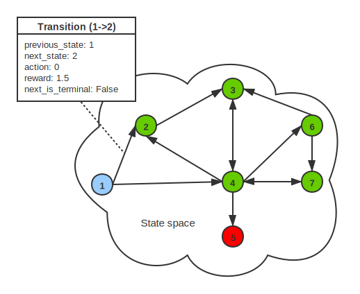
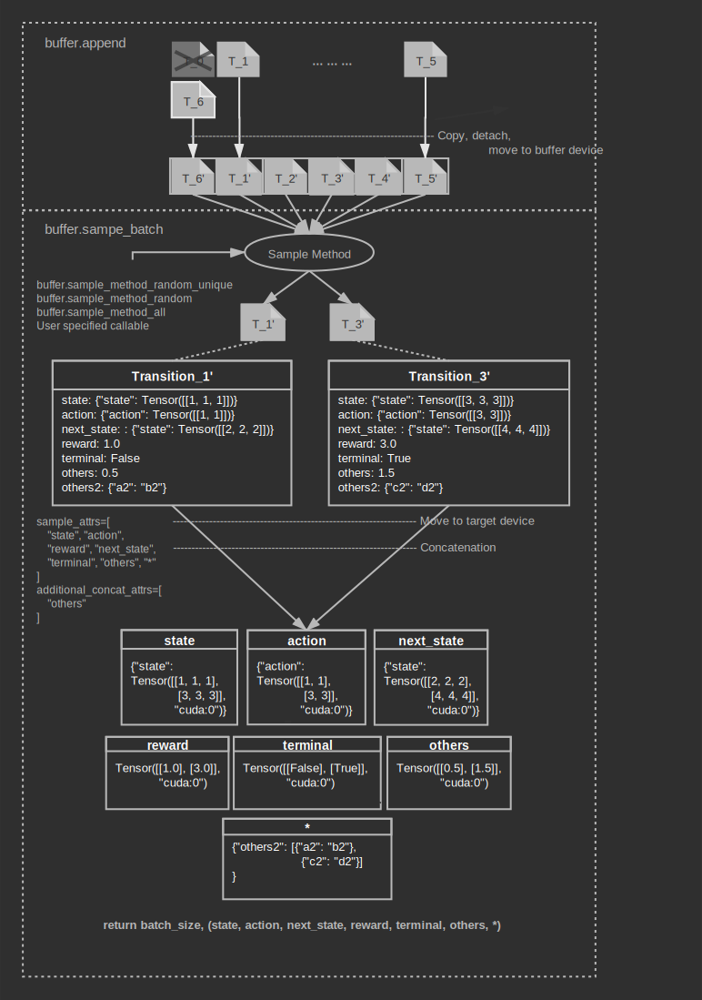

Architecture overview
================================
In this section, we will take a brief look at the internal implementations of
the Machin library, to better understand the functionality of every module.

Framework
--------------------------------
Framework is one of the core parts of the Machin library, framework is a collection of:

1. RL algorithm implementations (:mod:`machin.frame.algorithms`)
2. Replay buffer implementations (:mod:`machin.frame.buffers`)
3. Utility to help you initialize a framework (:mod:`machin.frame.helpers`)
4. Action space & parameter space noise generators (:mod:`machin.frame.noise`)

Algorithms
++++++++++++++++++++++++++++++++++++
**Models used by algorithms**

Currently, Machin supports three major types of model-free RL algorithms:

1. Value based algorithms
2. Deterministic policy based algorithms
3. Stochastic policy based algorithms

Algorithms could be grouped into respective categories with the following graph:

.. figure:: ../static/advance/architecture_overview/category.png
   :alt: algorithm_categories

   Algorithm categories

In order to provide a consistent api interface across all algorithms, and
minimize abstractions, Machin choose to place restrictions on the output format
of users' models. The restrictions are different according to the category of
the selected RL algorithm, these restrictions **could be changed/removed** if
users decides to inherit from the default implementation and alternate the
behavior of the ``update`` function. For example, the :class:`.DDPG` algorithm
uses :meth:`.DDPG.reward_func` to calculate the reward::

    @staticmethod
    def reward_function(reward, discount, next_value, terminal, _):
        next_value = next_value.to(reward.device)
        terminal = terminal.to(reward.device)
        return reward + discount * ~terminal * next_value

This function is designed for ``reward``, ``next_value``, ``terminal`` of shape
``[batch_size, 1]``, and a ``float`` discount. Users might want to implement a
vectorized reward function, which returns a reward of shape ``[batch_size, reward_dims]``,
then they will have to overload :meth:`.DDPG.reward_func` and make sure that other
statements in ``.DDPG.update`` will cooperate with their new reward function,
defined in their sub classes inherited from :class:`.DDPG`.

For a detailed list of these restrictions, please refer to
:ref:`Model requirements <model_requirements>` .

**APIs provided by algorithms**

All algorithms provide three core APIs:

1. Acting API, beginning with "act".
2. Storing API, beginning with "store".
3. Training API, with name "update"

Users will invoke the "act*" api provided by the framework during sampling,
to let their models produce an action with respect to their state input,
"*" indicates additional extensions such as "_with_noise", "_discreet", etc.
depending on the implementation and type of the RL framework.

Below is a list of supported acting APIs of different frameworks:

+-----------------+-------------------------+---------------------------------------------+---------------------+-----------------------+
| Algorithm class | Acting API              | Input & output                              | Discreet/Contiguous | Note                  |
+-----------------+-------------------------+---------------------------------------------+---------------------+-----------------------+
| | DQN           | act_discreet            | | Dict[str, State[batch_size, ...]]         | D                   |                       |
| | DQNPer        |                         | | -> Action[batch_size, 1]                  |                     |                       |
| | DQNApex       +-------------------------+---------------------------------------------+---------------------+-----------------------+
| | RAINBOW       | act_discreet_with_noise | | Dict[str, State[batch_size, ...]]         | D                   |                       |
|                 |                         | | -> Action[batch_size, 1]                  |                     |                       |
+-----------------+-------------------------+---------------------------------------------+---------------------+-----------------------+
| | DDPG          | act                     | | Dict[str, State[batch_size, ...]]         | C                   |                       |
| | DDPGPer       |                         | | -> Action[batch_size, action_dim]         |                     |                       |
| | HDDPG         +-------------------------+---------------------------------------------+---------------------+-----------------------+
| | TD3           | act_with_noise          | | Dict[str, State[batch_size, ...]]         | C                   |                       |
|                 |                         | | -> Action[batch_size, action_dim]         |                     |                       |
|                 +-------------------------+---------------------------------------------+---------------------+-----------------------+
|                 | act_discreet            | | Dict[str, State[batch_size, ...]]         | D                   |                       |
|                 |                         | | -> Action[batch_size, 1]                  |                     |                       |
|                 +-------------------------+---------------------------------------------+---------------------+-----------------------+
|                 | act_discreet_with_noise | | Dict[str, State[batch_size, ...]]         | D                   |                       |
|                 |                         | | -> Action[batch_size, 1]                  |                     |                       |
+-----------------+-------------------------+---------------------------------------------+---------------------+-----------------------+
| | A2C           | act                     | | Dict[str, State[batch_size, ...]] ->      | C/D                 | | Contiguous/Discreet |
| | A3C           |                         |                                             |                     | | depends on the      |
| | PPO           |                         | | Action[batch_size, ...],                  |                     | | distribution you    |
| | IMPALA        |                         | | Log_Prob[batch_size, 1],                  |                     | | are using to        |
| | SAC           |                         | | Entropy[batch_size, 1]                    |                     | | reparameterize      |
|                 |                         |                                             |                     | | your network        |
+-----------------+-------------------------+---------------------------------------------+---------------------+-----------------------+
| MADDPG          | act                     | | List[Dict[str, State[batch_size, ...]]]   | C                   |                       |
|                 |                         | | -> List[Action[batch_size, action_dim]]   |                     |                       |
|                 +-------------------------+---------------------------------------------+---------------------+-----------------------+
|                 | act_with_noise          | | List[Dict[str, State[batch_size, ...]]]   | C                   |                       |
|                 |                         | | -> List[Action[batch_size, action_dim]]   |                     |                       |
|                 +-------------------------+---------------------------------------------+---------------------+-----------------------+
|                 | act_discreet            | | List[Dict[str, State[batch_size, ...]]]   | D                   |                       |
|                 |                         | | -> List[Action[batch_size, 1]]            |                     |                       |
|                 +-------------------------+---------------------------------------------+---------------------+-----------------------+
|                 | act_discreet_with_noise | | List[Dict[str, State[batch_size, ...]]]   | D                   |                       |
|                 |                         | | -> List[Action[batch_size, 1]]            |                     |                       |
+-----------------+-------------------------+---------------------------------------------+---------------------+-----------------------+

Algorithms generally encapsulates a replay buffer inside, the replay buffer is not
necessarily a "real" replay buffer. For online algorithms such as A2C and PPO with
no replaying mechanisms, the replay buffer is used as a place to put all of the
samples, and is cleared after every training/update step::

    # sample a batch
    batch_size, (state, action, reward, next_state,
                 terminal, target_value, advantage) = \
        self.replay_buffer.sample_batch(-1,
                                        sample_method="all",
                                        ...)

    ...
    self.replay_buffer.clear()

Most frameworks supports storing a single transition step of a MDP process, or
storing the whole MDP process at once::

    some_framework.store_transition(transition: Union[Transition, Dict])
    some_framework.store_episode(episode: List[Union[Transition, Dict]])

However, some frameworks may only support the latter one of these two APIs (Eg: IMPALA),
due to the special sampling requirements of the algorithm.

Below is a list of supported storing APIs of different frameworks:

+-----------------+--------------------------------+---------------------------------+
| Algorithm class | Storing API                    | Note                            |
+-----------------+--------------------------------+---------------------------------+
| | DQN           | store_transition/store_episode |                                 |
| | DQNPer        |                                |                                 |
| | DQNApex| DDPG |                                |                                 |
| | DDPGPer       |                                |                                 |
| | DDPGApex      |                                |                                 |
| | HDDPG         |                                |                                 |
| | TD3           |                                |                                 |
| | SAC           |                                |                                 |
+-----------------+--------------------------------+---------------------------------+
| | MADDPG        | store_transition/store_episode | | Requires you to store         |
|                 |                                | | transitions/episodes          |
|                 |                                | | of all agents at the          |
|                 |                                | | same time.                    |
+-----------------+--------------------------------+---------------------------------+
| | RAINBOW       | store_transition/store_episode | | ``store_transition`` requires |
|                 |                                | | you to calculate the n-step   |
|                 |                                | | value manually.               |
+-----------------+--------------------------------+---------------------------------+
| | A2C           | store_transition/store_episode | | ``store_transition`` requires |
| | PPO           |                                | | you to calculate the n-step   |
| | A3C           |                                | | value, and the generalized    |
|                 |                                | | advantage estimation (GAE)    |
|                 |                                | | manually.                     |
+-----------------+--------------------------------+---------------------------------+
| | IMPALA        | store_episode                  |                                 |
+-----------------+--------------------------------+---------------------------------+

All frameworks supports the ``update`` function, but the keyword arguments
of the ``update`` function might be a little bit different. For example, DDPG
allows you to choose update actor/critic/their targets, individually, while
DQN only supports choose to update Q network/its target individually.

Moreover, the update function of offline algorithms such as DDPG and online
algorithms such as A2C and PPO are different. Because A2C and PPO will not
update on outdated samples, their ``update`` function contains an internal
update loop::

    # DDPG update:
    if episode > 100:
    for i in range(step.get()):
        ddpg.update()

    # PPO update:
    # update() already contains a loop
    ppo.store_episode(tmp_observations)
    ppo.update()

and their ``update`` will also clear the internal replay buffer
every time. So you are recommended to **read the implementation** of your
selected algorithm before using it somewhere.

Replay memory
++++++++++++++++++++++++++++++++
Replay memory is the second core part of the whole DQN framework, Machin provides
a sophisticated but clear implementation of replay memory, to accommodate the needs
of different frameworks.

**Transition**

in order to understand how it works, we should take a step back and reexamine the
process of a MDP (Markov Decision Process). A MDP process could be described as a
chain of **transition steps**.

   MDP (Markov Decision Process)

In Machin, we store each transition step as a :class:`.TransitionBase` object, this
class manages all data of a user defined transition step, by categorizing data into
three types: major attribute, sub attribute and custom attribute.

1. Major attribute: ``Dict[str, t.Tensor]``, used to describe complex state and action information.
2. Sub attributes: ``Union[Scalar, t.Tensor]``, used to store less complex states such as reward, terminal status, etc.
3. Custom attributes: ``Any``, used to store custom data structures describing environmental specific states, **must not have tensors** inside.

the default transition implementation is :class:`.Transition`, which have 5 attributes:

1. state (major attribute)
2. action (major attribute)
3. next_state (major attribute)
4. reward (sub attribute)
5. terminal (sub attribute)

Now that we have a very general transition data structure, which supports storing:

1. complex state information, such as visual(RGB-D), audio, physical(position, velocity, etc.),
   internal states of recurrent networks, etc.
2. complex action information, whether discreet or contiguous, single space or a combination
   of multitude of spaces, by storing them in different keys of the dictionary.
3. complex reward, whether scalar reward or vectorized reward.

We may use the stored samples to train networks in frameworks.

**Sample**

Sampling is the first step performed in almost every frameworks,
it may look like::

    batch_size, (state, action, reward, next_state, terminal, others) = \
            self.replay_buffer.sample_batch(self.batch_size,
                                            concatenate_samples,
                                            sample_method="random_unique",
                                            sample_attrs=[
                                                "state", "action",
                                                "reward", "next_state",
                                                "terminal", "*"
                                            ])

What secret actions do this segment of code performs internally? Well, nothing
other than "sampling" and "concatenation". Argument ``sample_method`` indicates
the sample selection method, ``sample_attrs`` indicates which attributes of each
sample we are going to acquire, "*" is a wildcard selector picking
up all unspecified attributes.

Then what does "concatenation" mean? To put it simply, it will only affect "major attributes"
and "sub attributes" of each sample, if you have specified ``additional_concat_attrs``, then
custom attributes can also be concatenated into a tensor. We may use a graph to explain this process:

   Buffer sampling & concatenation process

Noise
++++++++++++++++++++++++++++++++

Framework
--------------------------------