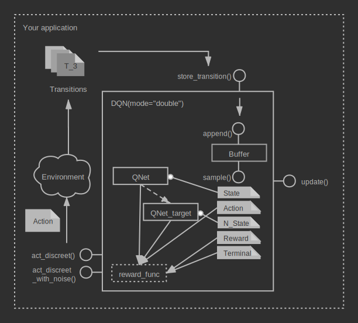
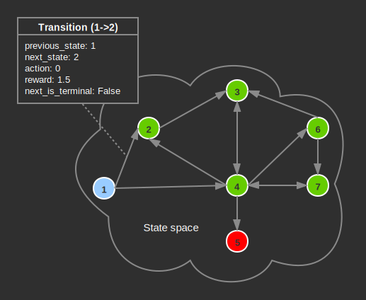

Data flow in machin
================================================================
**Author**: `Muhan Li <https://github.com/iffiX>`_

Data flow is the major thing you should be very careful with while using the
Machin library. Especially:

1. Data types
2. Tensor shapes
3. How to correctly store transitions.
4. How to correctly update your model.

If you are using the distributed algorithms, such as :class:`.A3C`, :class:`.IMPALA`, etc.
You should additionally take care of:

5. How to setup the distributed world correctly.
6. How to setup the distributed framework correctly.
7. How to perform synchronization, pass data, between processes.

In this tutorial, we are not going to cover the distributed part, and will focus on
the data flow in single agent RL algorithms.

The big picture
----------------------------------------------------------------
To give you a general idea of the data flow model in single agent RL algorithms,
we will take the DQN framework as an example and use a diagram to illustrate everything:

   Data flow in DQN

There are mainly three types of arrows in the diagram:

1. | The normal grey arrow: Represents data passed to functions by arguments, keyword
   | arguments, etc. And data returned by functions.
2. | The dashed gray arrow: The dashed gray arrow between the Q network and the target
   | Q network means "soft_update", which updates the parameters of the target Q network
   | by interpolating target Q and online Q.
3. | The circle gray arrows: There are two circled gray arrows:
   |
   |     N_State ---() QNet_target
   |     State ---() QNet
   |
   | These two circle gray arrows are special network calls named "safe_call", "safe_call"
   | is an enhanced keyword-argument-like caller, it will inspect arguments of the "forward"
   | function of your network, and fillin sub-keys of **major attributes** like **action**,
   | **state**, **next_state** from the batched sample. What major attributes are going to
   | be used by "safe_call" depends on the used RL framework and the model.
   |
   | If sub-keys defined in major attributes are present in arguments of the "forward" function.
   | then the corresponding sub-values will be used. Otherwise they would be ignored.
   |
   | "safe_call" will also inspect the input/output device of your model, or try to automatically
   | determine them, if they are not specified. Therefore, the tensors stored as sub-values of
   | these major attributes could be correctly moved to the target device.

Dive deeper
----------------------------------------------------------------
So what is happening under the hood exactly? How do we pass the observations
and actions to the framework, then expect it to perform some magical operation
and train our models behind the scenes? In this section, we are going to cover
all of these questions in the following order, this order is also the direction
of our data flow:

.. centered:: Transition -> Buffer -> Algorithm

Transition
+++++++++++++++++++++++++++++++++++++++++++++++++++++++++++++++++
Now let's take a step back and reexamine the process of a MDP (Markov Decision Process).
A MDP process could be described as a chain of **transition steps**.

   MDP (Markov Decision Process)

In Machin, we store each transition step as a :class:`.TransitionBase` object, this
class manages all data of a user defined transition step, by categorizing data into
three types: major attribute, sub attribute and custom attribute.

1. Major attribute: ``Dict[str, t.Tensor]``, used to describe complex state and action information.
2. Sub attributes: ``Union[Scalar, t.Tensor]``, used to store less complex states such as reward, terminal status, etc.
3. Custom attributes: ``Any``, used to store custom data structures describing environmental specific states, **must not have tensors** inside.

the default transition implementation is :class:`.Transition`, which have 5 attributes:

1. state (major attribute)
2. action (major attribute)
3. next_state (major attribute)
4. reward (sub attribute)
5. terminal (sub attribute)

**Note:**: The first dimension of **tensors** stored in major attributes and sub attributes
must mean batch size (Scalar sub attributes are safe). Currently, the constructor of the default
transition implementation :class:`.Transition` **requires batch size to be 1**, all algorithms
are only tested and validated with batch size equals to 1. Scalar type custom attributes, like
reward and terminal, will be considered as a tensor with shape ``[1, 1]``.

Now that we have a very general transition data structure, which supports storing:

1. complex state information, such as visual(RGB-D), audio, physical(position, velocity, etc.),
   internal states of recurrent networks, etc.
2. complex action information, whether discreet or contiguous, single space or a combination
   of multitude of spaces, by storing them in different keys of the dictionary.
3. complex reward, whether scalar reward or vectorized reward.

We may use this class to store the transition steps of a full MDP. :class:`.Transition` can
be constructed like::

    old_state = state = t.zeros([1, 5])
    action = t.zeros([1, 2])
    transition = {
        "state": {"state": old_state},
        "action": {"action": action},
        "next_state": {"state": state},
        "reward": 1.0,
        "terminal": False
    }
    transition = Transition(**transition)

During :class:`.Transition` instance initialization, tensors stored in major and sub attributes
will **be cloned then detached**, custom attributes will be **deep copied**.

:class:`.Transition` also supports :meth:`.Transition.to` method to move
internal tensors to the target pytorch device.

.. _data_flow_in_machin:buffer:

Buffer
+++++++++++++++++++++++++++++++++++++++++++++++++++++++++++++++++

Buffers (replay memory) is one of the core parts of the Machin library. Machin provides
a sophisticated but clear implementation of replay memory, to accommodate the needs
of different frameworks. In `The big picture`_ section, we have showed that the
buffer instance encapsulated in the DQN framework has two major APIs: "append" and "sample",

Append
*****************************************************************
Append is encapsulated by every framework, in their "store_*" APIs, some frameworks
might will add new attributes to the constructed transition object in there "store_*" APIs,
then call the "append" API of the buffer to add one or more transition objects to the buffer.

There are multiple buffer implementations, the basic :class:`.Buffer` class implements a simple
ring buffer. :class:`.PrioritizedBuffer` extends on the the basic :class:`.Buffer` class with
a prioritized weight tree. Distributed buffers are more interesting and complex because data
are distributed on all process members.

In conclusion, the "append" API just stores one or more transition objects into the buffer,
there are many internal events happening behind the scenes, and you need not worry about them.

Sample
*****************************************************************
Sampling is the first step performed in almost every frameworks,
it may look like::

    batch_size, (state, action, reward, next_state, terminal, others) = \
            self.replay_buffer.sample_batch(self.batch_size,
                                            concatenate_samples,
                                            sample_method="random_unique",
                                            sample_attrs=[
                                                "state", "action",
                                                "reward", "next_state",
                                                "terminal", "*"
                                            ])

What secret actions does this segment of code perform internally? Well, nothing
other than "sampling" and "concatenation". Argument ``sample_method`` indicates
the sample selection method, ``sample_attrs`` indicates which attributes of each
sample we are going to acquire, "*" is a wildcard selector picking
up all unspecified attributes.

Then what does "concatenation" mean? To put it simply, it will only affect "major attributes"
and "sub attributes" of each sample, if you have specified ``additional_concat_attrs``, then
custom attributes can also be concatenated into a tensor. We may use a graph to explain this
process happening in the basic :class:`.Buffer` class:

.. figure:: ../static/tutorials/data_flow_in_machin/buffer.svg
   :alt: buffer

   Buffer sampling & concatenation process

Apart from the simplest :class:`.Buffer`, there is also :class:`.PrioritizedBuffer` (for
prioritized experience replay), :class:`.DistributedBuffer` used in :class:`.IMPALA`,
and :class:`.DistributedPrioritizedBuffer` used in :class:`.DQNApex` and :class:`.DDPGApex`.

We will not discuss about the internal implementations of distributed buffers here.

Algorithm
+++++++++++++++++++++++++++++++++++++++++++++++++++++++++++++++++
Now that algorithms have got samples from buffers, they can
start training their models. The three types of model free RL algorithms
supported by Machin have three respective internal data path.

For more detailed descriptions of data paths and model requirements of all RL algorithms,
please refer to :doc:`/advance/algorithm_model_requirements`.

In order to bridge the gap between models and algorithms, Machin uses a function named :func:`.safe_call`
to pass data from algorithms to your models, and uses different class methods defined in
algorithms like :meth:`.DDPG.action_transform_function` to pack up raw data from your models
before using them in the algorithm framework. With this design, Machin is able to
achieve API consistency between algorithms while maintaining code simplicity.

Again, lets take the classic :class:`.DQN` framework as an example, we will use ``mode="double"``
here, so that a double DQN framework will be initialized, the models used
in the :class:`.DQN` framework are Q networks. Q networks should accept a ``state`` and
return ``value`` for each possible discreet action, ideally we would like to define the model
according to this description **exactly**, like the one below, which accepts a single ``state``
argument in its ``forward()`` function, and returns a value tensor::

    class QNet(nn.Module):
        def __init__(self, state_dim, action_num):
            super(QNet, self).__init__()

            self.fc1 = nn.Linear(state_dim, 16)
            self.fc2 = nn.Linear(16, 16)
            self.fc3 = nn.Linear(16, action_num)

        def forward(self, state):
            a = t.relu(self.fc1(state))
            a = t.relu(self.fc2(a))
            return self.fc3(a)

And now in the :meth:`.DQN.update` method, we have sampled a batch of ``state``, ``action``,
``next_state`` etc, to train this Q network::

    batch_size, (state, action, reward, next_state, terminal, others) = \
        self.replay_buffer.sample_batch(self.batch_size,
                                        concatenate_samples,
                                        sample_method="random_unique",
                                        sample_attrs=[
                                            "state", "action",
                                            "reward", "next_state",
                                            "terminal", "*"
                                        ])

where major attributes like ``state``, ``action``, ``next_state`` are **dictionaries of tensors**,
while sub attributes like ``reward`` and ``terminal`` are two tensors of shape ``[batch_size, 1]``,
we will ignore ``others`` for now, because if you are not inheriting from the DQN framework and
write your own :meth:`.DQN.reward_func`, ``others`` does nothing.

In order to get the target Q value, which is used as an value estimation of the next state, we
must use the Q network / the target Q network to criticize the sampled ``next_state``::

    q_value = self.criticize(state)

:meth:`DQN.criticize` internally calls :func:`.safe_call`::

    if use_target:
        return safe_call(self.qnet_target, state)
    else:
        return safe_call(self.qnet, state)

:func:`.safe_call` is a relatively complex function, it does the following things in general:

1. | Check input & output device of your model, if they are not defined, try to
   | automatically determine them by checking locations of all parameters.
2. | Check argument names of the ``forward`` method of your model, this step will fail
   | if it is not defined or your model is a ``JIT`` model complied by pytorch.
3. | Try to resolve values of arguments by looking them up in the passed dictionaries,
   | Additional keys in dictionaries that does not belong to args will be ignored.

Therefore, the sampled ``state`` must have the required key: "state", and "state" is the
first argument (exclude self) of ``QNet.forwrad``.

After forwarding, the Q network will pass predicted Q values back to the DQN framework,
and data path is complete, the result Q values of next step will be passed to :meth:`DQN.reward_func`
to calculate target Q values, and then new values will be used to train the online Q network.

Summary
----------------------------------------------------------------
Generally speaking, Just treat all above process as an "advanced kwargs call",
During sampling, you will interact with your environment, and store some state tensors as values
in a dictionary::

    old_state = state = t.zeros([1, 5])
    action = t.zeros([1, 2])
    for _ in range(100):
        dqn.store_transition({
            "state": {"state": old_state},
            "action": {"action": action},
            "next_state": {"state": state},
            "reward": 1.0,
            "terminal": False
        })

Then during training, you will invoke the update method of your framework, and it will
concatenate states, actions, and next states in the **first dimension**::

    batch_size, (state, action, reward, next_state, terminal, others) = \
            self.replay_buffer.sample_batch(self.batch_size,
                                            concatenate_samples,
                                            sample_method="random_unique",
                                            sample_attrs=[
                                                "state", "action",
                                                "reward", "next_state",
                                                "terminal", "*"
                                            ])

    # state = {"state": t.zeros([batch_size, 5])}
    # action = {"action": t.zeros([batch_size, 2])}
    # next_state = {"state": t.zeros([batch_size, 5])}

Then states, actions, and next states will be passed to your networks, **safely**, since
tensors will be automatically moved to your model's input device, and input device can
be automatically determined or manually specified::

    # DQN
    q_value = self.criticize(state)

    # DDPG
    next_value = self.criticize(next_state, next_action, True)

    # PPO
    __, new_action_log_prob, new_action_entropy, *_ = \
                    self.eval_act(state, action)
    ...
    value = self.criticize(state)

And criticized values will be used to update your networks, done.
