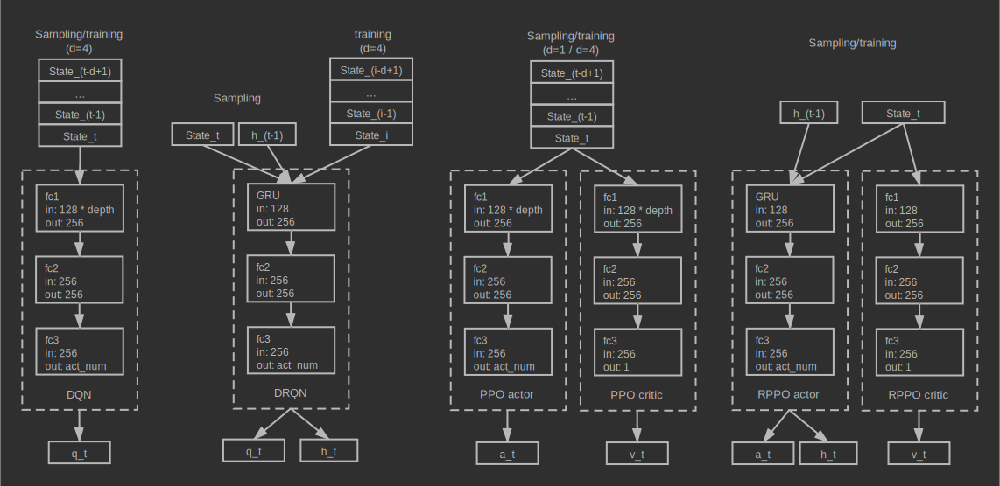
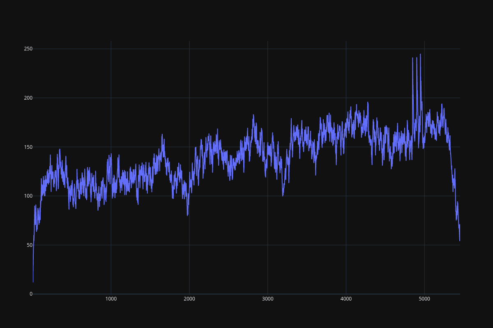
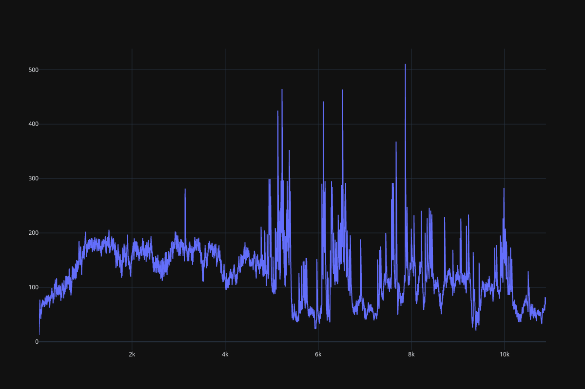
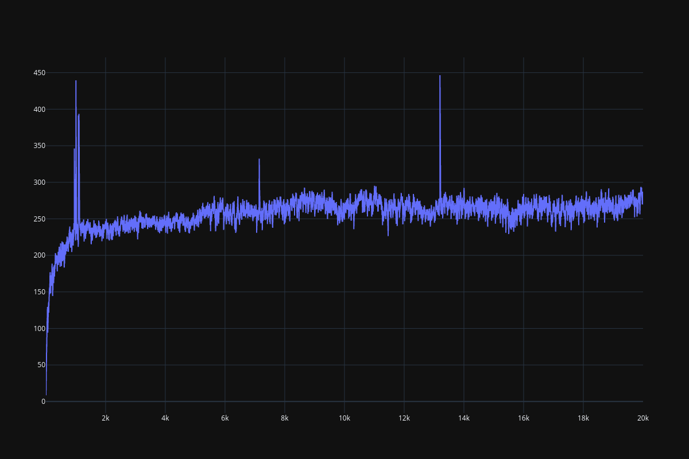
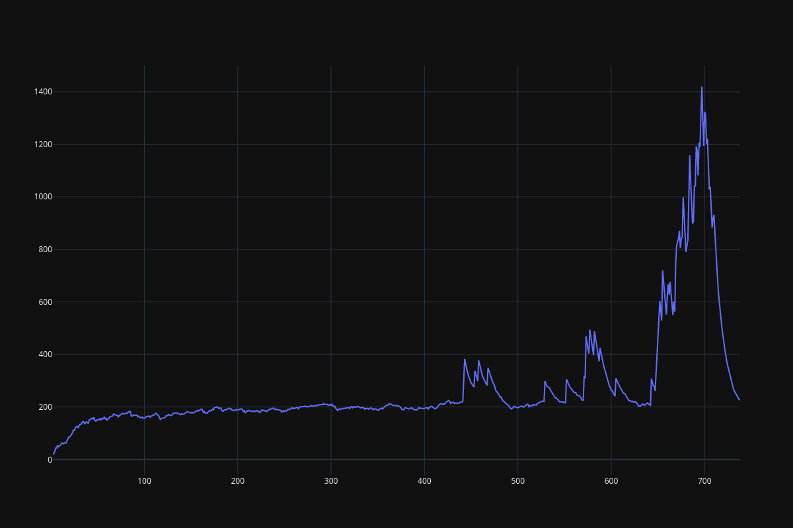
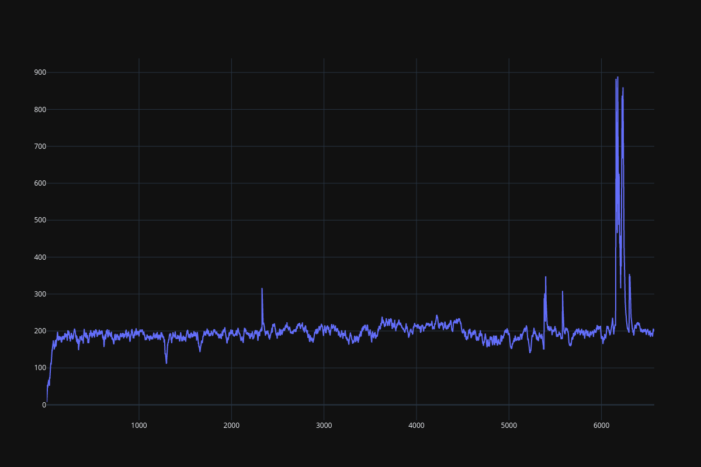

Recurrent networks
================================================================
**Author**: `Muhan Li <https://github.com/iffiX>`_

**Full code 1**: `DQN <https://github.com/iffiX/machin/blob/master/examples/tutorials/recurrent_networks/dqn.py>`_

**Full code 2**: `DRQN <https://github.com/iffiX/machin/blob/master/examples/tutorials/recurrent_networks/drqn.py>`_

**Full code 3**: `PPO <https://github.com/iffiX/machin/blob/master/examples/tutorials/recurrent_networks/ppo.py>`_

**Full code 4**: `RPPO <https://github.com/iffiX/machin/blob/master/examples/tutorials/recurrent_networks/rppo.py>`_

Preface
----------------------------------------------------------------
In this tutorial, we are going to try and implement the recurrent architecture in DQN and PPO architecture, the original architecture
of "DRQN" was described in `Deep Recurrent Q-Learning for Partially Observable MDPs <https://arxiv.org/pdf/1507.06527.pdf>`_, for the sake of
simplicity and this tutorial will discard the CNN part used to process Atari game screens, instead, we will directly access the internal
128 bytes of RAM of tested Atari games.

Now, in order to implement the recurrent architecture, we should have a solid grasp of
the following related aspects in advance:

1. `DQN framework <https://storage.googleapis.com/deepmind-media/dqn/DQNNaturePaper.pdf>`_
2. `Recurrent neural networks <https://en.wikipedia.org/wiki/Recurrent_neural_network>`_, `LSTM <https://www.bioinf.jku.at/publications/older/2604.pdf>`_ and `GRU <https://arxiv.org/pdf/1412.3555>`_
3. `MDP <https://en.wikipedia.org/wiki/Markov_decision_process>`_ and `POMDP <https://en.wikipedia.org/wiki/Partially_observable_Markov_decision_process>`_

Recurrent networks were introduced into the reinforcement learning field to deal with POMDP models, in which
agents are not able to observe the full state of the environment, and they have to rely on their internal
memories of their past observations. The `essay <https://arxiv.org/pdf/1507.06527.pdf>`_ used Atari games as
the benchmark suite, they compared DRQN with DQN in multiple scenarios, and shows that DRQN has significant
advantage over DQN in the `frostbite <https://gym.openai.com/envs/Frostbite-v0/>`_
game, while performing about as good as / fail to compete with DQN in many other Atari games.

For offline reinforcement learning frameworks relying on the "replay memory", like :class:`.DQN` and :class:`.DDPG`, the tricky bit
is that by the time of sampling, the trained models (online network and target network) are already different from the model
used to interact with the environment and produce samples, authors of the `essay <https://arxiv.org/pdf/1507.06527.pdf>`_
suggested two ways of updating, both ways requires to provide a contiguous period of samples to the network to compute hidden
states, and back propagation through time.

For online reinforcement learning frameworks such as :class:`.A2C` and :class:`.PPO` with no replaying mechanism, there is no need
to specifically recalculate hidden states, because by the time of training, the stored samples are still generated by a actor network
equal to (when update iteration=0)/ very close to (when update iteration > 0) the trained network. Therefore, hidden states can be
stored along with other observations,

We are going to show the detailed recurrent implementations in the above two reinforcement learning categories, using :class:`.DQNPer`
and :class:`.PPO` respectively.

Network architecture
----------------------------------------------------------------
Used network architectures are in the following graph:

   Network architectures

Design overview
----------------------------------------------------------------

DQN and DRQN
++++++++++++++++++++++++++++++++++++++++++++++++++++++++++++++++

.. Warning::

    Compared to the implementation provided in this `repo <https://github.com/marctuscher/DRQN-tensorflow/blob/master/src/networks/drqn.py>`_,
    our implementation of DRQN is **significantly more inefficient**, and potentially has **different result** because:

    1. Duplicate states are stored for (history_depth - 1) times.
    2. Only the last step in the bootstrapped random updates is performed, Q values evaluated in previous steps are not used.

    You may implement your own framework to overcome these shortcomings using the utilities provided by Machin.

Authors of the original paper choose to train the LSTM layer along with the CNN layers,
in order to deal with the "hidden state" input of the LSTM layer, they proposed two methods:

1. Bootstrapped sequential updates
2. Bootstrapped random updates

"Sequential updates" use the recurrent Q network to train through a whole episode, then BPTT (back propagate through time).
"Random updates" samples a random period of length "unrolled_time_steps" instead of a whole episode, other details are the same.

In order to achieve this with the :class:`.DQNPer` framework, we will have to store the history observations for each transition, since
the internal replay buffer does not store episodic boundaries between transitions::

    old_history = history.get()
    new_history = history.append(state).get()
    drqn.store_transition({
        "state": {"history_mem": old_history},
        "action": {"action": action},
        "next_state": {"history_mem": new_history},
        "reward": reward,
        "terminal": terminal
    })

Then we will also have to define two branches inside the ``forward`` function of our recurrent Q network, one branch
for normal action sampling and another branch for training::

    def forward(self, mem=None, hidden=None, history_mem=None):
        if mem is not None:
            # use `mem`, `hidden`, in sampling
            ...
        else:
            # use `history_mem`, in updating
            ...

We will show the details in the implementation section of this tutorial.

PPO and RPPO
++++++++++++++++++++++++++++++++++++++++++++++++++++++++++++++++
:class:`.PPO` is much easier to deal with, if we **do not BPTT**, then we just need to store hidden states along with
other states like::

    tmp_observations.append({
        "state": {"mem": old_state, "hidden": old_hidden},
        "action": {"action": action},
        "next_state": {"mem": state, "hidden": hidden},
        "reward": reward,
        "terminal": terminal
    })

However, not using BPTT will lose most benefits of recurrence, if you would like to use this method, then you need to implement
your own framework sampling entire episodes and not timesteps from the replay buffer. Then zero-pad the sampled episodes so they
are all the same length. Finally let your recurrent network go through the sampled episodes and calculate log probs/actions/hidden states.
You may refer to this `repo <https://github.com/siekmanj/r2l>`_ for more information.

Implementation
----------------------------------------------------------------
History
++++++++++++++++++++++++++++++++++++++++++++++++++++++++++++++++
We are going to design a `History` class which allow users to store new states by `append()` and returns a
fixed-length trajectory by `get()`, if there are not enough states to form a complete trajectory, then zero
will be used to form paddings::

    class History:
    def __init__(self, history_depth, state_shape):
        self.history = [t.zeros(state_shape) for _ in range(history_depth)]
        self.state_shape = state_shape

    def append(self, state):
        assert (t.is_tensor(state) and
                state.dtype == t.float32 and
                tuple(state.shape) == self.state_shape)
        self.history.append(state)
        self.history.pop(0)
        return self

    def get(self):
        # size: (1, history_depth, ...)
        return t.cat(self.history, dim=0).unsqueeze(0)

.. _recurrent_networks/dqn:

DQN
++++++++++++++++++++++++++++++++++++++++++++++++++++++++++++++++
The Q network will accept a transition trajectory of length `history_depth`, and returns a Q value tensor::

    class QNet(nn.Module):
    def __init__(self, history_depth, action_num):
        super(QNet, self).__init__()
        self.fc1 = nn.Linear(128 * history_depth, 256)
        self.fc2 = nn.Linear(256, 256)
        self.fc3 = nn.Linear(256, action_num)

    def forward(self, mem):
        return self.fc3(t.relu(
            self.fc2(t.relu(
                self.fc1(mem.flatten(start_dim=1))
            ))
        ))

In order to provide sampled trajectories to the network, we just need to store "history" instead of "state"::

    while not terminal:
        step += 1
        with t.no_grad():
            history.append(state)
            # agent model inference
            action = dqn.act_discrete_with_noise(
                {"mem": history.get()}
            )

            # info is {"ale.lives": self.ale.lives()}, not used here
            state, reward, terminal, _ = env.step(action.item())
            state = convert(state)
            total_reward += reward
            old_history = history.get()
            new_history = history.append(state).get()
            dqn.store_transition({
                "state": {"mem": old_history},
                "action": {"action": action},
                "next_state": {"mem": new_history},
                "reward": reward,
                "terminal": terminal
            })

DRQN
++++++++++++++++++++++++++++++++++++++++++++++++++++++++++++++++
DRQN network is a little bit more complex::

    class RecurrentQNet(nn.Module):
        def __init__(self, action_num):
            super(RecurrentQNet, self).__init__()
            self.gru = nn.GRU(128, 256, batch_first=True)
            self.fc1 = nn.Linear(256, 256)
            self.fc2 = nn.Linear(256, action_num)

        def forward(self, mem=None, hidden=None, history_mem=None):
            if mem is not None:
                # in sampling
                a, h = self.gru(mem.unsqueeze(1), hidden)
                return self.fc2(t.relu(
                    self.fc1(t.relu(
                        a.flatten(start_dim=1)
                    ))
                )), h
            else:
                # in updating
                batch_size = history_mem.shape[0]
                seq_length = history_mem.shape[1]
                hidden = t.zeros([1, batch_size, 256],
                                 device=history_mem.device)
                for i in range(seq_length):
                    _, hidden = self.gru(history_mem[:, i].unsqueeze(1), hidden)
                # a[:, -1] = h
                return self.fc2(t.relu(
                    self.fc1(t.relu(
                        hidden.transpose(0, 1).flatten(start_dim=1)
                    ))
                ))

As you can see, the forward method is divided into two parts, the first part is for normal acting,
where users will pass hidden states to the network manually and get actions during sampling::

    hidden = t.zeros([1, 1, 256])
    state = convert(env.reset())
    history = History(history_depth, (1, 128))

    while not terminal:
        step += 1
        with t.no_grad():
            old_state = state
            history.append(state)
            # agent model inference
            action, hidden = drqn.act_discrete_with_noise(
                {"mem": old_state, "hidden": hidden}
            )

The second part is used during updating, where the :class:`.DQNPer` framework will provide a batch of
trajectories to the network and get Q value tensor for **last state** in each trajectory::

    old_history = history.get()
    new_history = history.append(state).get()
    drqn.store_transition({
        "state": {"history_mem": old_history},
        "action": {"action": action},
        "next_state": {"history_mem": new_history},
        "reward": reward,
        "terminal": terminal
    })

PPO
++++++++++++++++++++++++++++++++++++++++++++++++++++++++++++++++
PPO is the same as :ref:`DQN <recurrent_networks/dqn>`, the actor network and critic network will accept a trajectory and return an action/value::

    class Actor(nn.Module):
        def __init__(self, history_depth, action_num):
            super(Actor, self).__init__()
            self.fc1 = nn.Linear(128 * history_depth, 256)
            self.fc2 = nn.Linear(256, 256)
            self.fc3 = nn.Linear(256, action_num)

        def forward(self, mem, action=None):
            a = t.relu(self.fc1(mem.flatten(start_dim=1)))
            a = t.relu(self.fc2(a))
            probs = t.softmax(self.fc3(a), dim=1)
            dist = Categorical(probs=probs)
            act = (action
                   if action is not None
                   else dist.sample())
            act_entropy = dist.entropy()
            act_log_prob = dist.log_prob(act.flatten())
            return act, act_log_prob, act_entropy

    class Critic(nn.Module):
        def __init__(self, history_depth):
            super(Critic, self).__init__()

            self.fc1 = nn.Linear(128 * history_depth, 256)
            self.fc2 = nn.Linear(256, 256)
            self.fc3 = nn.Linear(256, 1)

        def forward(self, mem):
            v = t.relu(self.fc1(mem.flatten(start_dim=1)))
            v = t.relu(self.fc2(v))
            v = self.fc3(v)
            return v

RPPO
++++++++++++++++++++++++++++++++++++++++++++++++++++++++++++++++
RPPO actor will accept a hidden state, critic will accept one state instead of a trajectory comprised of multiple states::

    class RecurrentActor(nn.Module):
        def __init__(self, action_num):
            super(RecurrentActor, self).__init__()
            self.gru = nn.GRU(128, 256, batch_first=True)
            self.fc1 = nn.Linear(256, 256)
            self.fc2 = nn.Linear(256, action_num)

        def forward(self, mem, hidden, action=None):
            hidden = hidden.transpose(0, 1)
            a, hidden = self.gru(mem.unsqueeze(1), hidden)
            a = self.fc2(t.relu(
                self.fc1(t.relu(a.flatten(start_dim=1)))
            ))
            probs = t.softmax(a, dim=1)
            dist = Categorical(probs=probs)
            act = (action
                   if action is not None
                   else dist.sample())
            act_entropy = dist.entropy()
            act_log_prob = dist.log_prob(act.flatten())
            return act, act_log_prob, act_entropy, hidden

    class Critic(nn.Module):
        def __init__(self):
            super(Critic, self).__init__()
            self.fc1 = nn.Linear(128, 256)
            self.fc2 = nn.Linear(256, 256)
            self.fc3 = nn.Linear(256, 1)

        def forward(self, mem):
            v = t.relu(self.fc1(mem))
            v = t.relu(self.fc2(v))
            v = self.fc3(v)
            return v

Test results
----------------------------------------------------------------

**Note**: These test results are put here for pure demonstration purpose, they are not intended for
statistical comparision.

It seems that the DRQN implementation is extremely unstable, DQN is not quite stable as well,
especially when `history_depth > 1`. PPO learns a little bit better than DQN when `history_depth = 1`,
but it is able to cross the 300 boundary when `history_depth = 4`,
RPPO is also able to overcome the 300 boundary after 6000 episodes. Since learning
rate is fine tuned, performance of all frameworks drop considerably after some point.

   DQN result

   DRQN result

   PPO result (history_depth=1)

   PPO result (history_depth=4)

   RPPO result
