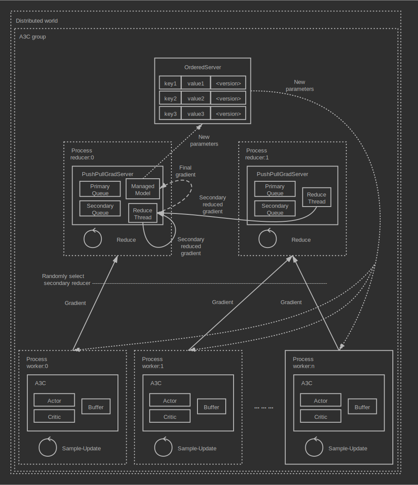
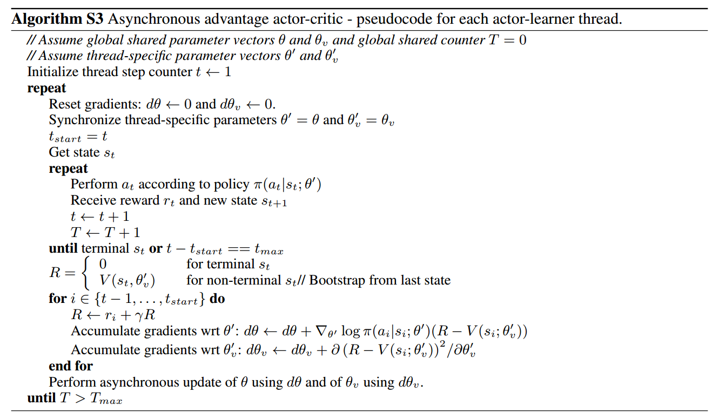
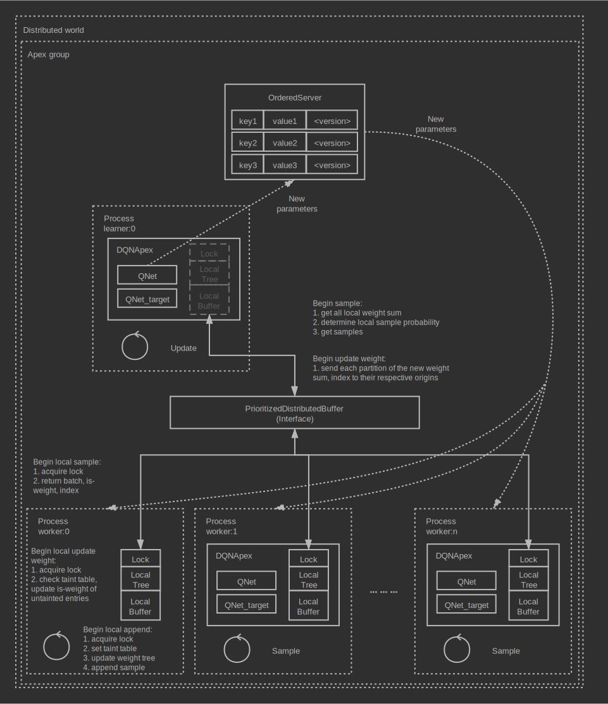
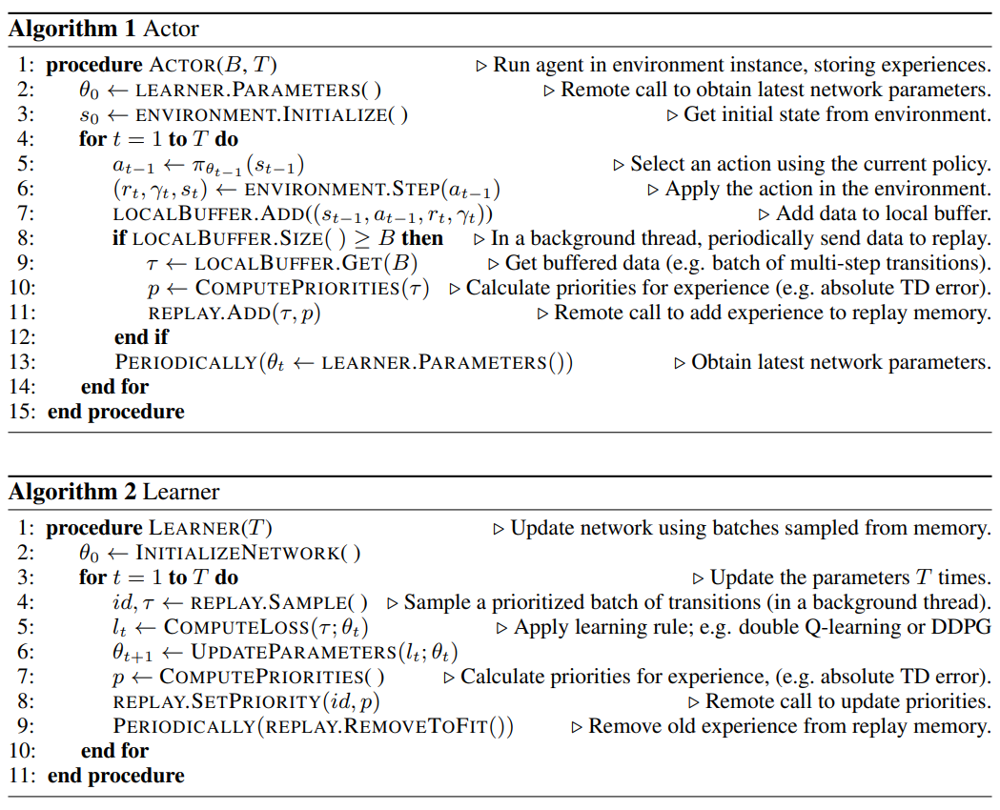

Unleash distributed power
================================================================
**Author**: `Muhan Li <https://github.com/iffiX>`_

In this tutorial, we are going to try out some distributed single agent RL algorithms,
they are:

1. :class:`.A3C`
2. :class:`.DQNApex` and :class:`.DDPGApex`
3. :class:`.IMPALA`

Now let's begin!

A3C
----------------------------------------------------------------

**Full code**: `A3C <https://github.com/iffiX/machin/blob/master/examples/tutorials/unleash_distributed_power/a3c.py>`_

A3C is the simplest distributed RL algorithm, among them all. We can describe its
implementation with the following graph:

   A3C architecture

And a segment of pseudo code:

   A3C pesudo code

A3C is basically a bunch of A2C agents with a gradient reduction server. A3C(A2C)
agents will interact with their environment simulators, train their local actors
and critics, then push gradients to the gradient reduction server, the gradient
reduction server will apply reduced gradients to its internal models (managed actor
and critic network), then push the updated parameters to a key-value server. Agents
will be able to pull the newest parameters and continue updating.

All A3C agents are fully asynchronous, gradient pushing & parameter pulling are asynchronous
as well.

We will use the "CartPole-v0" environment from OpenAI Gym as an example, the actor network
and critic network are as follows::

    class Actor(nn.Module):
        def __init__(self, state_dim, action_num):
            super(Actor, self).__init__()

            self.fc1 = nn.Linear(state_dim, 16)
            self.fc2 = nn.Linear(16, 16)
            self.fc3 = nn.Linear(16, action_num)

        def forward(self, state, action=None):
            a = t.relu(self.fc1(state))
            a = t.relu(self.fc2(a))
            probs = t.softmax(self.fc3(a), dim=1)
            dist = Categorical(probs=probs)
            act = (action
                   if action is not None
                   else dist.sample())
            act_entropy = dist.entropy()
            act_log_prob = dist.log_prob(act.flatten())
            return act, act_log_prob, act_entropy

    class Critic(nn.Module):
        def __init__(self, state_dim):
            super(Critic, self).__init__()

            self.fc1 = nn.Linear(state_dim, 16)
            self.fc2 = nn.Linear(16, 16)
            self.fc3 = nn.Linear(16, 1)

        def forward(self, state):
            v = t.relu(self.fc1(state))
            v = t.relu(self.fc2(v))
            v = self.fc3(v)
            return v

In order to initialize the :class:`.A3C` framework, we need to first initialize **the**
distributed world::

    # initlize distributed world first
    _world = World(world_size=3, rank=rank,
                   name=str(rank), rpc_timeout=20)

then provide a :class:`PushPullGradServer` to it, Machin provides some helpful utility functions
to aid inexperienced users initialize the distributed environment easily::

    from machin.frame.helpers.servers import grad_server_helper
    servers = grad_server_helper(
        lambda: Actor(observe_dim, action_num),
        lambda: Critic(observe_dim),
        learning_rate=5e-3
    )

**Note** all helpers from :mod:`machin.frame.helpers.servers` requires all
processes in the distributed world to enter.

Finally we can compose the complete setup of :class:`.A3C`::

    # initlize distributed world first
    _world = World(world_size=3, rank=rank,
                   name=str(rank), rpc_timeout=20)

    actor = Actor(observe_dim, action_num)
    critic = Critic(observe_dim)

    # in all test scenarios, all processes will be used as reducers
    servers = grad_server_helper(
        lambda: Actor(observe_dim, action_num),
        lambda: Critic(observe_dim),
        learning_rate=5e-3
    )
    a3c = A3C(actor, critic,
              nn.MSELoss(reduction='sum'),
              servers)

And start training, just as the A2C algorithm::

    # manually control syncing to improve performance
    a3c.set_sync(False)

    # begin training
    episode, step, reward_fulfilled = 0, 0, 0
    smoothed_total_reward = 0
    terminal = False

    while episode < max_episodes:
        episode += 1
        total_reward = 0
        terminal = False
        step = 0

        state = t.tensor(env.reset(), dtype=t.float32).view(1, observe_dim)

        # manually pull the newest parameters
        a3c.manual_sync()
        tmp_observations = []
        while not terminal and step <= max_steps:
            step += 1
            with t.no_grad():
                old_state = state
                # agent model inference
                action = a3c.act({"state": old_state})[0]
                state, reward, terminal, _ = env.step(action.item())
                state = t.tensor(state, dtype=t.float32).view(1, observe_dim)
                total_reward += reward

                tmp_observations.append({
                    "state": {"state": old_state},
                    "action": {"action": action},
                    "next_state": {"state": state},
                    "reward": reward,
                    "terminal": terminal or step == max_steps
                })

        # update
        a3c.store_episode(tmp_observations)
        a3c.update()

        # show reward
        smoothed_total_reward = (smoothed_total_reward * 0.9 +
                                 total_reward * 0.1)
        logger.info("Process {} Episode {} total reward={:.2f}"
                    .format(rank, episode, smoothed_total_reward))

        if smoothed_total_reward > solved_reward:
            reward_fulfilled += 1
            if reward_fulfilled >= solved_repeat:
                logger.info("Environment solved!")
                # will cause torch RPC to complain
                # since other processes may have not finished yet.
                # just for demonstration.
                exit(0)
        else:
            reward_fulfilled = 0

A3C agents should will be successfully trained within about 1500 episodes,
they converge much slower than A2C agents::

    [2020-07-31 00:21:37,690] <INFO>:default_logger:Process 1 Episode 1346 total reward=184.91
    [2020-07-31 00:21:37,723] <INFO>:default_logger:Process 0 Episode 1366 total reward=171.22
    [2020-07-31 00:21:37,813] <INFO>:default_logger:Process 2 Episode 1345 total reward=190.73
    [2020-07-31 00:21:37,903] <INFO>:default_logger:Process 1 Episode 1347 total reward=186.41
    [2020-07-31 00:21:37,928] <INFO>:default_logger:Process 0 Episode 1367 total reward=174.10
    [2020-07-31 00:21:38,000] <INFO>:default_logger:Process 2 Episode 1346 total reward=191.66
    [2020-07-31 00:21:38,000] <INFO>:default_logger:Environment solved!

DQNApex and DDPGApex
----------------------------------------------------------------

**Full code**: `DQNApex <https://github.com/iffiX/machin/blob/master/examples/tutorials/unleash_distributed_power/dqn_apex.py>`_

:class:`DQNApex` and :class:`DDPGApex` are actually based on the same architecture, therefore
in this section, we are going to take :class:`DQNApex` as an example, its distributed architecture
could be described in the following graph:

.. _dqn_apex:

   DQNApex architecture

And the pseudo code in `essay <https://arxiv.org/pdf/1803.00933.pdf>`_:

   DQN-Apex pesudo code

The Apex architecture decouples the sampling and updating process with the
prioritized replay buffer. There could be several implementations, such as:

1. using a central replay buffer on a single process
2. using a distributed buffer, with a central stopping signal.
3. using a distributed buffer, each buffer with a separate lock.

Machin choose the third implementation because it is most efficient:

#1 is slow because each appending requires a RPC process to update the global weight tree,
and it also doesn't scale when the number of workers(samplers) grows too large, such as
100+ workers.

The central lock used in #2 is meant to protect the importance sampling-updating process,
so each buffer maintains a local weight tree, during sampling, the learner will signal "STOP" to all workers,
and signal "START" to all workers when importance weight update is completed, however, this design does
not truly decouples learning and sampling, therefore most of the time workers are just hanging and wait for
the learner to complete updaing.

#3 design is the best, because each append operation is completely local (only needs to acquire
a local lock), and global sampling is complete decoupled from local appending (because lock are
immediately released after returning sampled data, and not till update complete) as show in
figure :numref:`dqn_apex`.

However, it could be very tricky to implement this process, because appending is still happening
after sampling and before the learner finishes updating importance sampling weights (is-weights),
therefore Machin uses a **taint table**, which is essentially a table full of auto increment counters,
each counter maps to an entry slot in the lower ring buffer, and is incremented if the entry has been
replaced with new entries. This replacement should will not be very often if the buffer has enough
space, (100000+), therefore guarantee the correctness of importance weight update.

**There is one thing to note**, it could be indefinitely long for learner to calculate
the virtual global weight sum tree using the root node of all local weight sum trees as leaves,
therefore at the time of sampling, the used weight sum of local trees is already outdated, and sampling
probability of each tree should have changed. However, if the size of each local buffer is large enough,
then the ratio of difference between the old collected local weight sums and current weight sums should be
acceptable.

Now that we know how the Apex framework is designed, we may try an example. We will use the "CartPole-v0"
environment from OpenAI Gym as an example, the Q networks is as follows::

    class QNet(nn.Module):
        def __init__(self, state_dim, action_num):
            super(QNet, self).__init__()

            self.fc1 = nn.Linear(state_dim, 16)
            self.fc2 = nn.Linear(16, 16)
            self.fc3 = nn.Linear(16, action_num)

        def forward(self, some_state):
            a = t.relu(self.fc1(some_state))
            a = t.relu(self.fc2(a))
            return self.fc3(a)

Because apex frameworks relies on the :class:`DistributedPrioritizedBuffer`, the learner needs to
know the position and service name of each local buffer, as show in figure :numref:`dqn_apex`,
in order to initialize the :class:`.Apex` framework, we need to provide a RPC process group,
where all learner(s) and workers will live on::

    apex_group = world.create_rpc_group("apex", ["0", "1", "2"])

And we will also provide a model server on which learner(s) will store the newest parameters and
workers will pull the newest parameters from the server. This kind of parameter server is different
from the :class:`PushPullGradServer` used above, and we will name it as :class:`PushPullModelServer`,
Currently, each :class:`PushPullModelServer` **only manages one model** per server instance,
and since there is only one model needs to be shared in DQN (the online Q network), we only need one
model server instance::

    servers = model_server_helper()
    dqn_apex = DQNApex(q_net, q_net_t,
                       t.optim.Adam,
                       nn.MSELoss(reduction='sum'),
                       apex_group,
                       (servers[0],),
                       replay_device=c.device,
                       replay_size=c.replay_size)

The tasks of learner(s) and workers are quite a bit different, since learner(s) only needs to update
their internal models repeatedly, using samples from workers' buffers, and workers only need to
do update-sample-update-sample..., they will run different branches in the main program.

Maybe you want to ask, why are we using **learner(s)**, isn't the original `essay <https://arxiv.org/pdf/1803.00933.pdf>`_
stating that there is only one learner and multiple workers? The answer is: Machin supports using `DistributedDataParallel`
(`DataParallel` is also supported)
from PyTorch inside DQNApex, so that you may distribute the updating task across **multiple learner processes**, if your models
is way too **large** to be computed by a single process. It is not sensible to using this technique with small models,
but for pure demonstration purpose, we will use it here::

    if rank in (2, 3):
        # learner_group.group is the wrapped torch.distributed.ProcessGroup
        learner_group = world.create_collective_group(ranks=[2, 3])

        # wrap the model with DistributedDataParallel
        # if current process is learner process 2 or 3
        q_net = DistributedDataParallel(module=QNet(observe_dim, action_num),
                                        process_group=learner_group.group)
        q_net_t = DistributedDataParallel(module=QNet(observe_dim, action_num),
                                          process_group=learner_group.group)
    else:
        q_net = QNet(observe_dim, action_num)
        q_net_t = QNet(observe_dim, action_num)

    # we may use a smaller batch size to train if we are using
    # DistributedDataParallel
    dqn_apex = DQNApex(q_net, q_net_t,
                       t.optim.Adam,
                       nn.MSELoss(reduction='sum'),
                       apex_group,
                       (servers[0],),
                       batch_size=50)

The main part of the training process is as follows::

    # synchronize all processes in the group, make sure
    # distributed buffer has been created on all processes
    # in apex_group
    apex_group.barrier()

    # manually control syncing to improve performance
    dqn_apex.set_sync(False)
    if rank in (0, 1):
        # Process 0 and 1 are workers(samplers)
        # begin training
        episode, step, reward_fulfilled = 0, 0, 0
        smoothed_total_reward = 0

        while episode < max_episodes:
            # sleep to wait for learners keep up
            sleep(0.1)
            episode += 1
            total_reward = 0
            terminal = False
            step = 0

            state = t.tensor(env.reset(), dtype=t.float32).view(1, observe_dim)

            # manually pull the newest parameters
            dqn_apex.manual_sync()
            while not terminal and step <= max_steps:
                step += 1
                with t.no_grad():
                    old_state = state
                    # agent model inference
                    action = dqn_apex.act_discrete_with_noise(
                        {"state": old_state}
                    )
                    state, reward, terminal, _ = env.step(action.item())
                    state = t.tensor(state, dtype=t.float32)\
                        .view(1, observe_dim)
                    total_reward += reward

                    dqn_apex.store_transition({
                        "state": {"state": old_state},
                        "action": {"action": action},
                        "next_state": {"state": state},
                        "reward": reward,
                        "terminal": terminal or step == max_steps
                    })

            smoothed_total_reward = (smoothed_total_reward * 0.9 +
                                     total_reward * 0.1)
            logger.info("Process {} Episode {} total reward={:.2f}"
                        .format(rank, episode, smoothed_total_reward))

            if smoothed_total_reward > solved_reward:
                reward_fulfilled += 1
                if reward_fulfilled >= solved_repeat:
                    logger.info("Environment solved!")

                    # will cause torch RPC to complain
                    # since other processes may have not finished yet.
                    # just for demonstration.
                    exit(0)
            else:
                reward_fulfilled = 0

    elif rank in (2, 3):
        # wait for enough samples
        while dqn_apex.replay_buffer.all_size() < 500:
            sleep(0.1)
        while True:
            dqn_apex.update()

Result::

    [2020-08-01 12:51:04,323] <INFO>:default_logger:Process 1 Episode 756 total reward=192.42
    [2020-08-01 12:51:04,335] <INFO>:default_logger:Process 0 Episode 738 total reward=187.58
    [2020-08-01 12:51:04,557] <INFO>:default_logger:Process 1 Episode 757 total reward=193.17
    [2020-08-01 12:51:04,603] <INFO>:default_logger:Process 0 Episode 739 total reward=188.72
    [2020-08-01 12:51:04,789] <INFO>:default_logger:Process 1 Episode 758 total reward=193.86
    [2020-08-01 12:51:04,789] <INFO>:default_logger:Environment solved!

IMPALA
----------------------------------------------------------------

**Full code**: `IMPALA <https://github.com/iffiX/machin/blob/master/examples/tutorials/unleash_distributed_power/impala.py>`_

